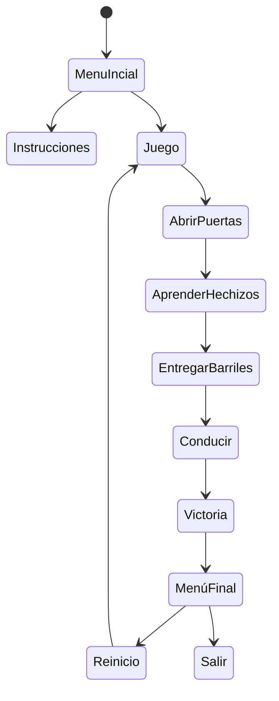
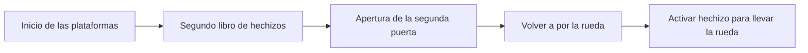
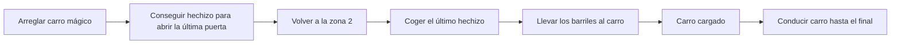
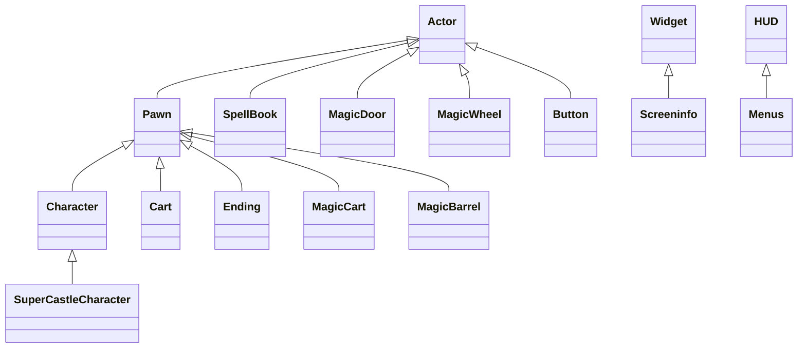

# Desarrollo de Videojuegos - Práctica 1: Aprendiz de Brujo

Se trata de un prototipo básico de videojuego de plataformas 3D en el que controlamos a un personaje que debe superar distintas pruebas para acabar el nivel. Desde aprender hechizos, hasta mover barriles y depositarlos en un carro son las tareas que el jugador deberá afrontar.

## Instalación y uso
Todo el contenido del proyecto está disponible aquí en el repositorio, salvo la subcarpeta StarterContent que ofrece Unreal Engine por defecto.
Esta subcarpeta debe incluirse en la carpeta Content. Si se tiene permiso, es posible [descargarla aquí](https://drive.google.com/file/d/1ece2mzryUjjU-GKg8I7tDDl_OTGqkTdx/view?usp=sharing).
A su vez, la carpeta StylizedProvencal debe estar dentro de Content. Para descargarla, entrar en la tienda de Epic Games: https://www.unrealengine.com/marketplace/en-US/product/stylized-fantasy-provencal/


## Preproducción
La práctica consiste en desarrollar el prototipo ejecutable de un videojuego de plataformas 2D para un sólo jugador esta vez en forma de aventura con pequeños puzles basados en tareas domésticas y cierta inspiración de la película de Fantasía. 

El videojuego consiste en superar ciertas pruebas, explicadas a continuación para completar todas las tareas y acabar el nivel.

El diseño tiene estas secciones:
- [Estética](#Estética)
  * [Gráficos](#Gráficos)
  * [Sonidos](#Sonidos)
- [Dinámica](#Dinámica)
  * [Objetivo](#Objetivo)
  * [Castigo](#Derrota)
- [Mecánica](#Mecánica)
  * [Avatar](#Avatar)
  * [Pociones](#Pociones)
  * [Barriles](#Barriles)
  * [Troncos](#Troncos)
  * [Balas](#Balas)
  * [Plataformas fantasma](#Plataformas)
  * [Puertas falsas](#Puertas)
  * [Trofeo](#Trofeo)
- [Contenido](#Contenido)
  * [Zona 1](#Zona-1)
  * [Zona 2](#Zona-2)
  * [Zona 3](#Zona-3)
  * [Zona 4](#Zona-4)
  * [Zona 5](#Zona-5)

### Estética
El juego usa el contenido de la plantilla Side Scroller y el paquete de texturas y objetos de StylizedProvencal. Se ha hecho uso de todos los materiales disponibles para crear un entorno medieval (cercano al de un mago). Además, se ha hecho uso de un modelo 3D de un libro de hechizos que está situado en varios puntos del mapa.

#### Gráficos
El juego usa solamente el contenido de la plantilla Side Scroller y Stylized Provencal.

#### Sonidos
No hay música ambiente y los sonidos utilizados son:
- **Magic Book**. Se activa al coger alguno de los múltiples libros de hechizos.
- **Open Door**. Cada vez que se active la cerradura de una puerta, sonará cómo se abre.
- **Fixing Car**. Cuando el jugador arregle el carro, hará este sonido junto con una animación.
- **Deliver Barrel**. Tras entregar un barril al carro, se indicará al jugador que lo ha conseguido.

### Dinámica
La dinámica del juego consiste en aprender varios hechizos (abrir puertas, llevar la rueda mágica y levitar) para abrir puertas, arreglar el carro y llenarlo de barriles para finalmente conducirlo hasta el final del nivel. Inicialmente se mostrará un menú con varias opciones (jugar, instrucciones y salir).



#### Objetivo
El objetivo del juego es aprender todos los hechizos del mapa, arreglar el carro mágico, entregar los barriles y conducir el carro hasta el final del juego.

#### Castigo
No existe castigo de muerte o reinicio del nivel. La única penalización serán los barriles, que tienen resistencia limitada. Si son golpeados, cambiarán de color hasta romperse y reaparecer en el punto de origen. 

### Contenido
A continuación detallamos el contenido más importante del juego.

#### Avatar
El clásico maniquí de Unreal Engine que se puede mover y saltar es el avatar que controla el jugador.

#### Hechizos
Hay tres tipos, y deberemos coger todos para completar las tareas del nivel.

- **Abrir puertas**. Sirve para abrir las distintas puertas del nivel que desbloquerán más libros o partes del mapa.
- **Activar rueda mágica**. Activará la rueda rota al principio del mapa, que se desplazará hasta arreglar el carro mágico.
- **Levitación**. Con este hechizo nos será posible hacer levitar los barriles repartidos para llevarlos hasta el carro arregldo.
 
#### Barriles

Los barriles (2 repartidos en la parte final del mapa) permanecerán estáticos hasta que sepamos hacerlos levitar. Cuando nos acerquemos, y tengamos el hechizo, podremos moverlos hasta que toquen al carro mágico. En caso de que los hagamos chocar, aguantarán 2 o 3 golpes (se volverán rojos), reapareciendo en su punto original con la vida restaurada.

#### Rueda mágica

Este objeto se encuentra al incio del mapa, pero tras una puerta bloqueada, que será abierta cuando el jugador encuentre el libro de hechizos correspondiente. A su lado, hay un libro más que será el que la lleve a su destino al lado del carro estropeado para arreglarlo.

#### Carro mágico

Este vehículo está roto en medio del mapa, y deberá ser arreglado para rellenarlo con los barriles esparcidos y poder llevarlos al mago al final del mapa.

### Contenido
Estos son los diagramas topológicos de las distintas zonas del nivel. Sería interesante añadir alguna captura de dibujos o esquemas sobre el nivel y sus contenidos.

#### Zona-1

El juego comienza con una vista donde se verán varias puertas cerradas, y objetos tras ellas. Inicialmente el jugador solo podrá coger el libro que tiene delante para abrir la primera puerta y continuar con el nivel

```mermaid
graph LR;
    iniAvatar[Inicio del avatar]-->firstSpll[Primer hechizo]-->openDoor[Abrir la primera puerta];
    openDoor[Abrir la primera puerta]-->explore obstacles[Explorar la siguiente parte del mapa para descubrir más libros];
```

#### Zona-2

Tras haber abierto la primera puerta, el jugador explorará las plataformas que tiene delante, consiguiendo un libro en lo alto que desbloquea la segunda puerta al incio del nivel, con la rueda y su libro.



#### Zona-3

La tercera zona tiene el carro, los barriles y el último libro de hechizos bloqueado por una última puerta en la Zona 2.



## Producción

Las tareas se han realizado y el esfuerzo ha sido repartido entre los autores.

| Estado  |  Tarea  |  Fecha  |  
|:-:|:--|:-:|
| ✔ | Diseño: Primer borrador | 4-5-2023 |
| ✔ | Mecánica: Puertas y libos | 5-5-2023 |
| ✔ | Mecánica: Rueda y carro | 10-5-2023 |
| ✔ | Mecánica: Plataformas y diseño | 13-5-2023 |
| ✔ | Mecánica: Barriles y carro | 15-4-2023 |
| ✔ | Mecánica: Menús, sonidos y efectos | 17-5-2023 |
| ✔ | Mecánica: Detalles y bugs | 20-5-2023 |

Las clases principales que se han desarrollados son las siguientes.



## Posproducción


## Referencias
Fall Guys, de Mediatonic Games.


